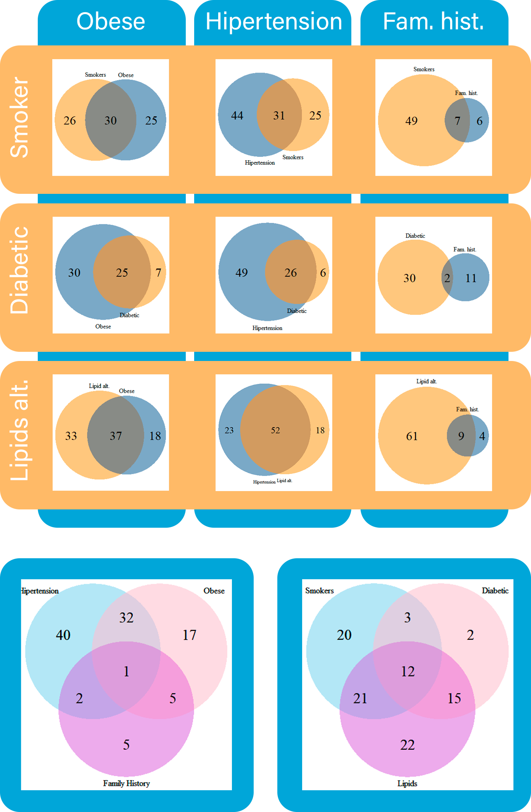

```{r Introduccion, include=FALSE}
knitr::opts_chunk$set(echo = TRUE)

```

<div style="margin-bottom:100px;background-color:rgb(15, 15, 15); margin-top:60px">
<div style="padding-top: 10px; padding-right: 15px; padding-bottom: 10px; padding-left: 15px">
<h2> Introduction </h2>
<h5>To optimally analyze the given dataset, we started by searching information and collecting research from universities, institutions and organizations with experience in cardiology. Then we proceeded to apply the knowledge acquired in analyzing the dataset and looking for possible combinations that bring new information to improve the prediction of cardiac events.</h5>

</div>
<div class="alert alert-dismissible alert-warning"  style="padding-top: 10px; padding-right: 15px; padding-bottom: 10px; padding-left: 15px; margin-top:60px">


<h1>Data analysis</h1>


<h5>In this section, we analyze how different factors affect the probability of cardiac events by themselves.</h5>
</div>
<div class="alert alert-dismissible alert-primary" style=" padding-left: 15px">
  <h2>Gender</h2>

</div>

<div style="padding-top: 10px; padding-right: 15px; padding-bottom: 60px; padding-left: 15px">


<h5>The gender of patients in cardiac events is considered an important factor. According to an investigation led by the  <a href=" https://jamanetwork.com/journals/jamainternalmedicine/fullarticle/2548254"> Norwegian University of Science and Technology</a>, men have roughly twice the risk of cardiac events compared to women. As we can see on the charts, while gender distribution on the dataset is roughly even, 80% of patients which have had cardiac events are men.</h5>


<h3 style="margin-top:10px">Gender graphic (with and without events)</h3> 
<div style="margin-top: 10px; margin-bottom:10px" >

```{r GeneroPorEvento, echo=FALSE,message=FALSE,warning=FALSE,fig.dim=c(10,4)}
library(readxl)
dataset <- read_excel("C:/Users/fabri/Downloads/dataset.xlsx")
library(plotrix)

Female <-as.numeric(nrow(subset(dataset, dataset$Genero == 0)))
Male <- as.numeric(nrow(subset(dataset, dataset$Genero == 1)))

FPercentage <- round((Female * 100) / (Female + Male))
MPercentage <- round((Male * 100) / (Female + Male))
par(mar=c(3,0,3,0))
pie(c(FPercentage,MPercentage),main = "Gender Distribution", labels = c(paste(FPercentage,"%"),paste(MPercentage,"%")),col = c("#F4A236","#2A9FD6"),cex = 1, radius = 1)
legend(1.2,0.6,c("Female", "Male"),fill = c("#F4A236","#2A9FD6"),cex = 0.8)

```

<h5>In this graph we can highlight that we have a high density of male patient than female</h5>
</div>

<h3 style="margin-top:20px; margin-bottom:10px">Events by gender</h3>

```{r GeneroSinEvento, echo=FALSE,message=FALSE,warning=FALSE, fig.dim=c(10,5)}
library(readxl)
dataset <- read_excel("C:/Users/fabri/Downloads/dataset.xlsx")
library(plotrix)

Event <- subset(dataset, dataset$Evento == 1, select = c(Genero))
Female <- as.numeric(nrow(subset(Event, Event$Genero == 0)))
Male <- as.numeric(nrow(subset(Event, Event$Genero == 1)))

FPercentage <- round(Female * 100 / (Female + Male))
MPercentage <- round(Male * 100 / (Female + Male))
par(mar=c(3,0,3,0))
pie(c(FPercentage,MPercentage),main = "Cardiac Events by Gender", labels = c(paste(FPercentage,"%"),paste(MPercentage,"%")),col = c("#F4A236","#2A9FD6"),cex = 1, radius = 1)
legend(1.2,0.6,c("Female", "Male"),fill = c("#F4A236","#2A9FD6"),cex = 0.8)
```

</div>


<div class="alert alert-dismissible alert-primary">

<h2>Events by age</h2> 


</div>
<div style="padding-top: 10px; padding-right: 15px; padding-bottom: 10px; padding-left: 15px">

<h5 style="margin-bottom:15px">Age distribution of cardiac events must be taken into account. Even though research shows that age by itself cannot lead to cardiac issues, it increases the risk of other symptoms, rising the probability of cardiac events.</h5>

```{r EdadPorEvento, fig.dim=c(10, 6),echo=FALSE,message=FALSE,warning=FALSE}
library(readxl)
dataset <- read_excel("C:/Users/fabri/Downloads/dataset.xlsx")
library(plotrix)
library(ggplot2)
attach(dataset)
hadEvent <- subset(dataset, Evento==1)
noEvent <- subset(dataset, Evento==0)
age <- c(hadEvent$Edad, noEvent$Edad)
event <- c(rep("Had event", times=length(hadEvent$Edad)),rep("Hasn't had event",
          times=length(noEvent$Edad)))
ageAndEvents <- data.frame(age, event)
ggplot(ageAndEvents, aes(x=age,fill=event)) + geom_density(alpha = 0.5) + ylab("Density") + xlab("Age") + ggtitle("Density of events per age") + scale_fill_manual(values=c("#FA5553", "#5295FA")) + xlim(c(17,100))
```


<h5>With this graphic we can see that the density of the age that had an event are people between 35 and 81 years old </h5>

```{r EdadPorE1vento, echo=FALSE,message=FALSE,warning=FALSE}
library(readxl)
dataset <- read_excel("C:/Users/fabri/Downloads/dataset.xlsx")
library(plotrix)
library(kableExtra)
ageAndEvents <- subset(dataset, dataset$Evento == 1, select = c(Evento,Edad))


countJoven <- 0
countAdulto <- 0
countViejo <- 0


for (val in ageAndEvents$Edad) {
if(val<31)  countJoven = countJoven+1
if(val>=31 && val<65) countAdulto = countAdulto +1
if(val>=65) countViejo = countViejo +1
}

Stage <- c("Young adult","Adult","Older adult")

EdadTotal <- countJoven+countAdulto+countViejo
PorcentajeJoven <- round((countJoven*100)/121)
PorcentajeAdulto <- round((countAdulto*100)/121)
PorcentajeViejo <- round((countViejo*100)/121)

Percentage<- c(PorcentajeJoven ,PorcentajeAdulto ,PorcentajeViejo)


tablaDeEdad <- data.frame(Stage,Percentage)
kableExtra::kable(tablaDeEdad,"html") %>%
  kable_styling(bootstrap_options = c("striped", "hover"),full_width = F)


```


</div>

<div class="alert alert-dismissible alert-primary" style=" padding-left: 15px">

<h2>Associated symptoms</h2>

</div>

<div style="padding-top: 20px; padding-right: 15px; padding-bottom: 25px; padding-left: 15px">


```{r SintomasAsociadosConEvento, echo=FALSE,message=FALSE,warning=FALSE,fig.dim=c(10,4)}
library(readxl)
dataset <- read_excel("C:/Users/fabri/Downloads/dataset.xlsx")
library(plotrix)


SintomasEvento <-as.numeric( nrow(subset(dataset, dataset$SA == 1 & dataset$Evento == 1)))
SintomasSinEvento <- as.numeric(nrow(subset(dataset, dataset$SA == 0 & dataset$Evento == 1)))
cantTotalGen <- SintomasEvento + SintomasSinEvento

SAPPercentage <- round((SintomasEvento * 100) / (SintomasEvento + SintomasSinEvento))
SASINPPercentage <- round((SintomasSinEvento * 100) / (SintomasEvento + SintomasSinEvento))
par(mar=c(3,0,3,0))
pie(c(SAPPercentage,SASINPPercentage),main = "Cardiac Events by associated symptoms", labels = c(paste(SAPPercentage,"%"),paste(SASINPPercentage,"%")),col = c("#F4A236","#2A9FD6"),cex = 1, radius = 1)

legend(1.2,0.6,c("With associated symptoms", "Without associated symptoms"),fill = c("#F4A236","#2A9FD6"),cex = 0.8)
```
<h5 style="margin-top:15px">This graph shows relevant information, containing the distribution of patients who had a cardiac event and presented associated symptoms at the time of arrival on the hospital. As we can see, 54% of people who had a cardiac event presented associated symptoms, so this means that more than half of people that present associated symptoms are likely to suffer a cardiac event..</h5>
</div>

<div class="alert alert-dismissible alert-primary" style=" padding-left: 15px; margin-top:20px">
  <h2>Diabetics</h2>
</div>

<div style="padding-top: 5px; padding-right: 15px; padding-bottom: 60px; padding-left: 15px">

<h5>Diabetes is strongly related to heart diseases. Adults with diabetes are two to three times more likely to have a cardiovascular disease than people without diabetes even when glucose levels are under control. People with diabetes are more probable to have other conditions that contribute to the risk of developing cardiovascular disease (hypertension, high cholesterol and triglycerides or obesity). This supports the results in which 11% of the people in the dataset is diabetic, but 28% of people who suffered a cardiac event is diabetic.</h5>

<h3 style="margin-top:10px">Diabetics in dataset(with and without events)</h3> 
<div style="margin-top: 10px; margin-bottom:10px" >

```{r DiabeticosAnalysis, echo=FALSE,message=FALSE,warning=FALSE,fig.dim=c(10,4)}
library(readxl)
dataset <- read_excel("C:/Users/fabri/Downloads/dataset.xlsx")
library(plotrix)

Diabetic <-as.numeric(nrow(subset(dataset, dataset$DBT == 1)))
NonDiabetic <- as.numeric(nrow(subset(dataset, dataset$DBT == 0)))

DPercentage <- round((Diabetic * 100) / (Diabetic + NonDiabetic))
NPercentage <- round((NonDiabetic * 100) / (Diabetic + NonDiabetic))
par(mar=c(3,0,3,0))
pie(c(DPercentage,NPercentage),main = "Diabetic Percentage", labels = c(paste(DPercentage,"%"),paste(NPercentage,"%")),col = c("#F4A236","#2A9FD6"),cex = 1,init.angle=25 , radius = 1)
legend(1.2,0.6,c("Diabetic", "Non diabetic"),fill = c("#F4A236","#2A9FD6"),cex = 0.8)


```


</div>
</div>

<div style="padding-top: 5px; padding-right: 15px; padding-bottom: 60px; padding-left: 15px">

<h3 style="margin-top:10px">Diabetics who had an event (with and without events)</h3> 
<div style="margin-top: 10px; margin-bottom:10px" >

```{r DiabeticosAnalysisEvent, echo=FALSE,message=FALSE,warning=FALSE,fig.dim=c(10,4)}
library(readxl)
dataset <- read_excel("C:/Users/fabri/Downloads/dataset.xlsx")
library(plotrix)

Diab <- subset(dataset, dataset$Evento == 1, select = c(DBT))
Diabetic <-as.numeric(nrow(subset(Diab, Diab$DBT == 1)))
NonDiabetic <- as.numeric(nrow(subset(Diab, Diab$DBT == 0)))

DPercentage <- round((Diabetic * 100) / (Diabetic + NonDiabetic))
NPercentage <- round((NonDiabetic * 100) / (Diabetic + NonDiabetic))
par(mar=c(3,0,3,0))
pie(c(DPercentage,NPercentage),main = "Cardiac Events by Diabetic or Non-diabetic", labels = c(paste(DPercentage,"%"),paste(NPercentage,"%")),col = c("#F4A236","#2A9FD6"),cex = 1,init.angle=25 , radius = 1)
legend(1.2,0.6,c("Is diabetic", "Isn't diabetic"),fill = c("#F4A236","#2A9FD6"),cex = 0.8)

```


</div>
</div>

<div class="alert alert-dismissible alert-primary" style=" padding-left: 15px; margin-top:20px">
  <h2>Smoking</h2>
</div>

<div style="padding-top: 5px; padding-right: 15px; padding-bottom: 60px; padding-left: 15px">

<h5>Smoking cigarettes is a major risk factor for heart disease according to an article by  <a href="https://www.nhlbi.nih.gov/health-topics/smoking-and-your-heart">the National Heart, Lung and Blood Institute (U.S).</a> Smoking increases the probability of plaque buildup inside coronary arteries, which may lead to clogs, blood clots, heart disease, heart failure or a heart attack.</h5>

<h3 style="margin-top:10px">Diabetics in dataset(with and without events)</h3> 
<div style="margin-top: 10px; margin-bottom:10px" >

```{r SmokeAnalysis, echo=FALSE,message=FALSE,warning=FALSE,fig.dim=c(10,4)}
library(readxl)
dataset <- read_excel("C:/Users/fabri/Downloads/dataset.xlsx")
library(plotrix)

Smoker <-as.numeric(nrow(subset(dataset, dataset$TBQ == 1)))
NonSmoker <- as.numeric(nrow(subset(dataset, dataset$TBQ == 0)))

SPercentage <- round((Smoker * 100) / (Smoker + NonSmoker))
NPercentage <- round((NonSmoker * 100) / (Smoker + NonSmoker))
par(mar=c(3,0,3,0))
pie(c(SPercentage,NPercentage),main = "Smoker Percentage", labels = c(paste(SPercentage,"%"),paste(NPercentage,"%")),col = c("#F4A236","#2A9FD6"),cex = 1,init.angle=25 , radius = 1)
legend(1.2,0.6,c("Smoker", "Non smoker"),fill = c("#F4A236","#2A9FD6"),cex = 0.8)


```

</div>
</div>

<div style="padding-top: 5px; padding-right: 15px; padding-bottom: 60px; padding-left: 15px">

<h3 style="margin-top:10px">Smokers who had an event</h3> 
<div style="margin-top: 10px; margin-bottom:10px" >

```{r SmokeEventAnalysisEvent, echo=FALSE,message=FALSE,warning=FALSE,fig.dim=c(10,4)}
library(readxl)
dataset <- read_excel("C:/Users/fabri/Downloads/dataset.xlsx")
library(plotrix)

TBQ <- subset(dataset, dataset$TBQ == 1, select = c(Evento))
Smoker <-as.numeric(nrow(subset(TBQ, TBQ$Evento == 1)))
NonSmoker <- as.numeric(nrow(subset(TBQ, TBQ$Evento == 0)))

SPercentage <- round((Smoker * 100) / (Smoker + NonSmoker))
NPercentage <- round((NonSmoker * 100) / (Smoker + NonSmoker))
par(mar=c(3,0,3,0))
pie(c(SPercentage,NPercentage),main = "Smokers with Cardiac Events", labels = c(paste(SPercentage,"%"),paste(NPercentage,"%")),col = c("#F4A236","#2A9FD6"),cex = 1,init.angle=25 , radius = 1)
legend(1.2,0.6,c("Suffers event", "Doesn't suffer event"),fill = c("#F4A236","#2A9FD6"),cex = 0.8)


```


</div>
</div>


<div class="alert alert-dismissible alert-primary" style=" padding-left: 15px; margin-top:20px">
  <h2>Family history</h2>
</div>

<div style="padding-top: 5px; padding-right: 15px; padding-bottom: 60px; padding-left: 15px">

<h3 style="margin-top:10px">Patients with family history(with and without events)</h3> 
<div style="margin-top: 10px; margin-bottom:10px" >

```{r AHFAnalysis, echo=FALSE,message=FALSE,warning=FALSE,fig.dim=c(10,4)}
library(readxl)
dataset <- read_excel("C:/Users/fabri/Downloads/dataset.xlsx")
library(plotrix)
Antecedentes <-as.numeric(nrow(subset(dataset, dataset$AHF == 1)))
SinAntecedentes <- as.numeric(nrow(subset(dataset, dataset$AHF == 0)))

APercentage <- round((Antecedentes * 100) / (Antecedentes + SinAntecedentes))
NPercentage <- round((SinAntecedentes * 100) / (Antecedentes + SinAntecedentes))
par(mar=c(3,0,3,0))
pie(c(SPercentage,NPercentage),main = "Family History Percentage", labels = c(paste(SPercentage,"%"),paste(NPercentage,"%")),col = c("#F4A236","#2A9FD6"),cex = 1,init.angle=25 , radius = 1)
legend(1.2,0.6,c("With family history", "Without family history"),fill = c("#F4A236","#2A9FD6"),cex = 0.8)

```

<h3 style="margin-top:20px; margin-bottom:15px">Family history with event</h3>

```{r AHFAnalysis2, echo=FALSE,message=FALSE,warning=FALSE,fig.dim=c(10,4)}
library(readxl)
dataset <- read_excel("C:/Users/fabri/Downloads/dataset.xlsx")
library(plotrix)
AHF <- subset(dataset, dataset$AHF == 1, select = c(Evento))
Antecedentes <-as.numeric(nrow(subset(AHF, AHF$Evento == 1)))
SinAntecedentes <- as.numeric(nrow(subset(AHF, AHF$Evento == 0)))

SPercentage <- round((Antecedentes * 100) / (Antecedentes + SinAntecedentes))
NPercentage <- round((SinAntecedentes * 100) / (Antecedentes + SinAntecedentes))
par(mar=c(3,0,3,0))
pie(c(SPercentage,NPercentage),main = "People with Family History and Cardiac Events", labels = c(paste(SPercentage,"%"),paste(NPercentage,"%")),col = c("#F4A236","#2A9FD6"),cex = 1,init.angle=25 , radius = 1)
legend(1.2,0.6,c("Suffers event", "Doesn't suffer event"),fill = c("#F4A236","#2A9FD6"),cex = 0.8)

```
</div>
</div>

<div class="alert alert-dismissible alert-warning" style="margin-top:100px; margin-bottom:10px">
<h1>Interpretation</h1>

<h5>In this section we look for match metadatas and found new data from them</h5>
</div>


<div class="alert alert-dismissible alert-primary" style="padding-left: 15px; margin-bottom:10px">

<h2>Intersetion between patient with events</h2>

</div>
<div style="padding-top: 20px; padding-right: 15px; padding-bottom: 25px; padding-left: 15px">


  

<h5 style="margin-top:20px"> To further analyze which factors produce cardiac events, the intersection between the symptoms the patients presented must be analyzed to define a more accurate prediction.</h5>

<div style="margin-top:20px">

```{r Mosaico_Interpretation, echo=FALSE,message=FALSE,warning=FALSE,fig.dim=c(10,4)}
library(readxl)
dataset <- read_excel("C:/Users/fabri/Downloads/dataset.xlsx")
library(ggplot2)
attach(dataset)
percent <- function(all , percentToCalculate){
  (percentToCalculate*100)/all
}

obes <- data.frame(subset(dataset,dataset$OBES==1))
eventObes <- obes$Evento
percentOfEventOnObes <- percent(length(eventObes),length(which(eventObes==1)))

tbq <- data.frame(subset(dataset,dataset$TBQ==1))
eventTbq <- tbq$Evento
percentOfEventOnTbq <- percent(length(eventTbq),length(which(eventTbq==1)))

hta <- data.frame(subset(dataset,dataset$HTA==1))
eventHta <- hta$Evento
percentOfEventOnHta <- percent(length(eventHta),length(which(eventHta==1)))

dbt <- data.frame(subset(dataset,dataset$DBT==1))
eventDbt <- dbt$Evento
percentOfEventOnDbt <- percent(length(eventDbt),length(which(eventDbt==1)))

ahf <- data.frame(subset(dataset,dataset$AHF==1))
eventAhf <- ahf$Evento
percentOfEventOnAhf <- percent(length(eventAhf),length(which(eventAhf==1)))

dlp <- data.frame(subset(dataset,dataset$DLP==1))
eventDlp <- dlp$Evento
percentOfEventOnDlp <- percent(length(eventDlp),length(which(eventDlp==1)))

sequenceOfPercentage <- c(percentOfEventOnAhf,percentOfEventOnDbt,percentOfEventOnDlp,percentOfEventOnObes,percentOfEventOnTbq,percentOfEventOnHta)
legendsForGraphic <- c("Obese",
                       "Smoker",
                       "Hiper tension",
                       "Diabetic",
                       "Family history",
                       "Lipids alteration")
barplot(sequenceOfPercentage,col=c("#E01661","#6FD2E5","#FFC800","#93C700","#710092","#F46B17"),legend.text = legendsForGraphic,ylim=c(0,45),xlim = c(0,18),main = "Percentage of event per syntom \n by category independently",ylab = "%")
```
</div>
</div>
<div class="alert alert-dismissible alert-primary" style="padding-left: 15px; margin-bottom:10px; margin-top:60px">

<h2>Events by age and gender</h2>

</div>

<div style="padding-top: 20px; padding-right: 15px; padding-bottom: 25px; padding-left: 15px">

```{r AgeAndGender_Interpretation, echo=FALSE,message=FALSE,warning=FALSE,fig.dim=c(10,4)}
library(readxl)
dataset <- read_excel("C:/Users/fabri/Downloads/dataset.xlsx")
library(ggplot2)
attach(dataset)
pplwithevents <- subset(dataset, Evento==1)
eventsFemale <- subset(pplwithevents, Genero==0)
eventsMale <- subset(pplwithevents, Genero==1)
age <- c(eventsFemale$Edad,eventsMale$Edad)
Sex <- c(rep("Female",times=length(eventsFemale$Edad)), rep("Male",times=length(eventsMale$Edad)))
densitypersex <- data.frame(age,Sex)
ggplot(densitypersex,aes(x=age,fill=Sex)) + geom_density(alpha = 0.5) + ylab("Density") + xlab("Age") + ggtitle("Events per age and sex")
```

<h5 style="margin-top:15px">While age and gender cannot cause a cardiac event by themselves, they affect how cardiovascular diseases develop on different sections of the population. As seen on the data analysis section, age increases the risk of other symptoms. Also, heart diseases behave differently on men and women: heart diseases develop later on women in relation to men, as we can see on the age mean, for men is 62 while for women is 65. The peak on women age distribution, could be attributed to a decline in the natural hormone estrogen in post-menopausal women, according to an article by American Health Organization <a href="https://www.heart.org/en/health-topics/consumer-healthcare/what-is-cardiovascular-disease/menopause-and-heart-disease#:~:text=A%20decline%20in%20the%20natural,expand%20to%20accommodate%20blood%20flow."> (link)</a></h5>

<h3 style="margin-top:25px; margin-bottom:15px">Graphic of female events</h3>

```{r female_AgeAndGender_Interpretation, echo=FALSE,message=FALSE,warning=FALSE,fig.dim=c(10,4)}
library(readxl)
dataset <- read_excel("C:/Users/fabri/Downloads/dataset.xlsx")
library(ggplot2)
eventsFemale <- subset(dataset, Evento==1 & Genero==0)
age <- eventsFemale$Edad
halfOne <- subset(eventsFemale, Edad<58)
mean1 <- round(mean(halfOne$Edad), digits = 1)
halfTwo <- subset(eventsFemale, Edad>58)
mean2 <- round(mean(halfTwo$Edad), digits = 1)
ggplot(eventsFemale, aes(x = Edad, fill = "hotpink")) + geom_density(alpha = 0.5) + theme(legend.position = "none") + ylab("Density") + xlab("Age") + ggtitle("Events in women") + geom_vline(aes(xintercept = mean(age)),col='#706A70') + geom_text(aes(x= mean(age)-2, label=paste0("Mean\n",round(mean(age), digits = 1)), y=0.03)) + geom_vline(aes(xintercept = mean1, col='orangered')) + geom_text(aes(x= mean1-2, label=paste0("Peak 1\n",mean1), y=0.02))+ geom_vline(aes(xintercept = mean2, col='orangered')) + geom_text(aes(x= mean2+2, label=paste0("Peak 2\n",mean2), y=0.037))
```


```{r Interpretacion_Table_AgePerSex, echo=FALSE,message=FALSE,warning=FALSE}
library(readxl)
dataset <- read_excel("C:/Users/fabri/Downloads/dataset.xlsx")
library(plotrix)
library(kableExtra)

attach(dataset)
eventsFemale <- subset(dataset, Evento==1 & Genero==0)
eventsMale <- subset(dataset, Evento==1 & Genero==1)
AgeMean <- c(round(mean(eventsMale$Edad)),round(mean(eventsFemale$Edad)))
Sex <- c("Male","Female")
meanAgeOfPeopleWithEvents <- data.frame(Sex,AgeMean)

kableExtra::kable(meanAgeOfPeopleWithEvents,"html") %>%
  kable_styling(bootstrap_options = c("striped", "hover"),full_width = F)


```

</div>


<div class="alert alert-dismissible alert-primary" style=" padding-left: 15px; margin-top:60px" >

<h2>Cuantity of event by duration</h2>

</div> 

<div style="padding-top: 20px; padding-right: 15px; padding-bottom: 25px; padding-left: 15px">

<h3 style="margin-top:10px; margin-bottom:10px">Events by duration and ubication</h3>

```{r Interpretacion_cantEventosPorDuracionYUbicacion, echo=FALSE,message=FALSE,warning=FALSE,results='hide',fig.dim=c(10,5)}
library(readxl)
dataset <- read_excel("C:/Users/fabri/Downloads/dataset.xlsx")
 library(ggplot2)

pplStitch <- subset(dataset, dataset$CD==-1&dataset$Evento==1)
pplOther <- subset(dataset, dataset$CD==0&dataset$Evento==1)
pplOpressive <- subset(dataset, dataset$CD==1&dataset$Evento==1)

values <- c(nrow(subset(pplStitch,pplStitch$DD==-1)),
            nrow(subset(pplStitch,pplStitch$DD==0)),
            nrow(subset(pplStitch,pplStitch$DD==1)),
            nrow(subset(pplOther,pplOther$DD==-1)),
            nrow(subset(pplOther,pplOther$DD==0)),
            nrow(subset(pplOther,pplOther$DD==1)),
            nrow(subset(pplOpressive,pplOpressive$DD==-1)),
            nrow(subset(pplOpressive,pplOpressive$DD==0)),
            nrow(subset(pplOpressive,pplOpressive$DD==1)))

painType <- c(rep("Stitch" , 3) , rep("Other" , 3) , rep("Opressive" , 3))
duration <- rep(c("Less than a minute" , "More than 20 minutes" , "1 to 20 minutes") , 3)

dataComplete <- data.frame(painType,duration,values)
ggplot(dataComplete, aes(fill=duration, y=values, x=painType)) + 
  geom_bar(position="dodge", stat="identity")+
  xlab("Pain Type")+
  ylab("Cuantity of events")+
  ggtitle("Ammount of event in certeain time by caracteristics")

```

<h5>In the next graph we evaluate the different types pain suffered before the event.
For each type of pain we see the ammount of events for different durations of
said pain.
From this graph we conclude that most of the events are often produced after
an opressive type of pain.
We can also see that duration of the pain is almost independent of the type,
because all types share the same distribution of people with events by its time.
Less than a minute is where less people suffers an event, while most people who suffers
an event suffers it in more than 20 minutes.</h5>

<h3 style="margin-top:50px; margin-bottom:10px">Events by duration</h3>

```{r Interpretacion_cantEventosPorDuracion, echo=FALSE,message=FALSE,warning=FALSE,results='hide',fig.dim=c(8,5)}
library(readxl)
dataset <- read_excel("C:/Users/fabri/Downloads/dataset.xlsx")
library(plotrix)

Eventos <- subset(dataset, dataset$Evento == 1)

EventosA <- subset(Eventos, Eventos$DD == -1)
EventosB <- subset(Eventos, Eventos$DD == 1)
EventosC <- subset(Eventos, Eventos$DD == 0)

Frequency <- c(nrow(EventosA),nrow(EventosB), nrow(EventosC))
legends <- c("Less than a minute","1 to 20 minute","More than 20 minute")
par(mar=c(3,8,5,6))

barplot(Frequency, col=rev(heat.colors(length(table(legends)))), legend.text=legends, xlim = c(0,6), main="Cuantity of events by duration of pain", ylab="Cuantity")

```

<h3 style="margin-top:50px; margin-bottom:10px">Opressive</h3>

```{r Interpretacion_dolorOpresivo, echo=FALSE,message=FALSE,warning=FALSE,results='hide',fig.dim=c(8,5)}
library(readxl)
dataset <- read_excel("C:/Users/fabri/Downloads/dataset.xlsx")
library(plotrix)

percent <- function(all , percentToCalculate){
  (percentToCalculate*100)/all
}

pplOpressive <- subset(dataset,dataset$CD==-1&dataset$Evento==1)
less1Min <- round(percent(nrow(pplOpressive),nrow(subset(pplOpressive,pplOpressive$DD==-1))))
mor20Min <- round(percent(nrow(pplOpressive),nrow(subset(pplOpressive,pplOpressive$DD==0))))
Oneto20 <- round(percent(nrow(pplOpressive),nrow(subset(pplOpressive,pplOpressive$DD==1)))) 


par(mar=c(3,0,3,0))
pie(c(less1Min,mor20Min,Oneto20),main = "Duration Of pain until event on opressive type of pain", labels = c(paste("  ",less1Min,"%"),paste(mor20Min,"%"),paste(Oneto20,"%")),col = c("#DA4531","#2A9FD6","#F4A236"),cex = 1, radius = 1)

legend(1.2,0.6,c("More than 20 min"," 1 to 20 min","Less than 1 min"),fill = c("#2A9FD6","#F4A236","#DA4531"),cex = 0.8)


```

</div>

&nbsp;

<div class="alert alert-dismissible alert-primary" style="padding-left: 15px; margin-bottom:10px; margin-top:60px">

<h2>Patients with more than one event </h2>


</div>

<div style="padding-top: 20px; padding-right: 15px; padding-bottom: 25px; padding-left: 15px">


```{r Interpretacion_Table_AgePerCant, echo=FALSE,message=FALSE,warning=FALSE,fig.dim=c(10,5)}
library(readxl)
dataset <- read_excel("C:/Users/fabri/Downloads/dataset.xlsx")
library(plotrix)
attach(dataset)
familyHistoryAndQuantity <- subset(dataset, (Evento==1 & AHF==1 & CantE==1 & TBQ==1 & OBES==0) | (Evento==1 & AHF==1 & CantE==1 & TBQ==0 & OBES==1) | (Evento==1 & AHF==1 & CantE==1 & TBQ==0 & OBES==0))
familyHistoryTotal <- subset(dataset, (Evento==1 & AHF==1 & TBQ==1 & OBES==0) | (Evento==1 & AHF==1 & TBQ==0 & OBES==1) | (Evento==1 & AHF==1 & TBQ==0 & OBES==0))
smokingAndQuantity <- subset(dataset, (Evento==1 & TBQ==1 & CantE==1 & AHF==1 & OBES==0) | (Evento==1 & TBQ==1 & CantE==1 & AHF==0 & OBES==1) | (Evento==1 & TBQ==1 & CantE==1 & AHF==0 & OBES==0))
smokingTotal <- subset(dataset, (Evento==1 & TBQ==1 & AHF==1 & OBES==0) | (Evento==1 & TBQ==1 & AHF==0 & OBES==1) | (Evento==1 & TBQ==1 & AHF==0 & OBES==0))
obesityAndQuantity <- subset(dataset, (Evento==1 & OBES==1 & CantE==1 & AHF==1 & TBQ==0) | (Evento==1 & OBES==1 & CantE==1 & AHF==0 & TBQ==1) | (Evento==1 & OBES==1 & CantE==1 & AHF==0 & TBQ==0))
obesityTotal <- subset(dataset, (Evento==1 & OBES==1 & AHF==1 & TBQ==0) | (Evento==1 & OBES==1 & AHF==0 & TBQ==1) | (Evento==1 & OBES==1 & AHF==0 & TBQ==0))

percentFamilyHistory <- nrow(familyHistoryAndQuantity) / nrow(familyHistoryTotal)
percentSmoking <- nrow(smokingAndQuantity) / nrow(smokingTotal)
percentObesity <- nrow(obesityAndQuantity) / nrow(obesityTotal)

barplot(c(percentFamilyHistory,percentSmoking,percentObesity),
        main = "Probability of an individual having another event knowing they suffered from one:\n Analyzed in relation to several factors",
        xlab = "Factor",
        ylab = "Probability of having another event",
        names.arg = c("Individuals with family history", "Individuals that smoke","Individuals that are obese"),
        col = "#F4A236",
        ylim = c(0,0.6),
        sub = "(Intersection between categories limited to one)")

```
<h5 style="margin-top:20px">This graph shows the percentage of people that suffered from more than one event in relation to various factors. In order to maintain accuracy the people we took into account can only suffer from up to 2 of each factor, therefore reducing the amount of intersections between factors. (This doesn't apply to the first bar which takes all factors into account).</h5>

<div style="margin-top:20px"></div>
```{r Interpretacion_torta, echo=FALSE,message=FALSE,warning=FALSE,fig.dim=c(10,5)}
library(readxl)
dataset <- read_excel("C:/Users/fabri/Downloads/dataset.xlsx")
library(plotrix)
attach(dataset)
oneEvent <- subset(dataset, Evento==1 & CantE==0)
moreThanOneEvent <- subset(dataset, Evento==1 & CantE==1)
percentOne <- nrow(oneEvent) / nrow(subset(dataset, Evento==1)) *100
percentMoreThanOne <- nrow(moreThanOneEvent) / nrow(subset(dataset, Evento==1)) *100
percentages <- c(percentOne,percentMoreThanOne)
label1 <- paste("People with one event (", round(percentOne, digits = 1), "%)")
label2 <- paste("People with more than one event (", round(percentMoreThanOne, digits = 1),"%)")
lbls <- c(label1, label2)
pie(percentages, labels = lbls, col = c("#2A9FD6", "#F4A236"), main = "Percentage of individuals who had an event that suffer from another or more",
      explode = 0.05)

```
<h5 style="margin-top:15px">In these graphs we analyzed how many patients that suffered from a cardiac episode later suffered from another or more. The pie chart shows these percentages, and reflects that 57.9% of people who have an event later had another or more. The bar chart shows the percentages of patients that had an event and were obese, smokers or had family history, that also suffered from another event. In order to reduce inaccuracy, within each factor we only took into account people that fit within one or no other category, therefore reducing the intersection between categories to 1 or none. The barplot shows that individuals that smoke are likelier to suffer from another episode, followed by ones who are obese and ones with family history.     </h5>

</div>
</div>
